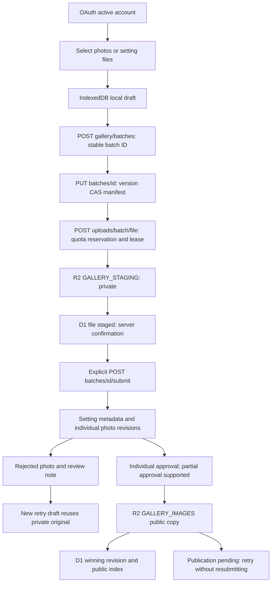
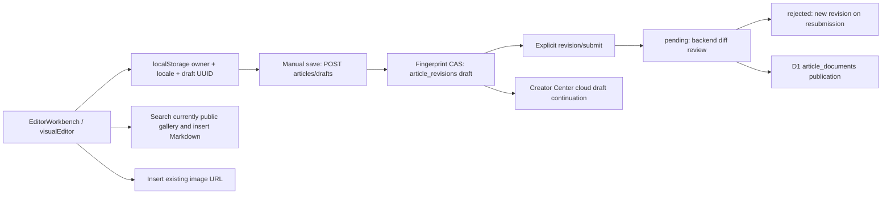

# Upload, review and publication funnel audit

Audit date: 2026-10-09. Repositories: `LinkTh1rsty/kamitsubaki-wiki-site` and `LinkTh1rsty/kamitsubaki-wiki-site-backend`. Evidence below comes from reading the actual current V3.1.0 workspaces, not filenames or the reference design. The workspaces contain earlier unrelated changes; those must not be swept into upload PRs. No production writes or deployment are authorized by this project.

## Existing requests and state transitions

Current articles do not have a private-new-image publication step. Enabling the shared gallery upload switch alone would allow the article to publish before its independently reviewed images. It is not a safe implementation of article image insertion.

## Traceable implementation evidence

Paths in this table are repository-relative; FE means frontend, BE means backend. Line numbers describe the audited baseline and can move during implementation.

| Concern | Actual implementation | Evidence |
| --- | --- | --- |
| Gallery pages | Setting and standalone-photo pages mount separate uploader controllers; CreationWorkbench review UI is explicitly a prototype when not live | FE `pages/[locale]/gallery/manage.astro`, `pages/[locale]/gallery/manage/photos.astro`, `components/CreationWorkbench.astro:13-36` |
| File selection | Only saves locally; upload and submit are separate manual actions | FE `scripts/galleryUploader.js:70,78-85`; `scripts/galleryPhotoUploader.js:29,35-43` |
| Shared transport | Uppy, three concurrent uploads, 120s timeout, retry network/408/429/5xx; 100% bytes means saving, not staged | FE `lib/galleryUploadQueue.mjs:7-53`, `lib/uploadPresentation.mjs` |
| Local gallery drafts | IndexedDB keyed by owner or photos:owner, one active draft per kind; cloud already supports many batches | FE `lib/galleryDraftStore.mjs:1-3`; BE `gallery/collections.js:161-172` |
| Draft concurrency | D1 batch version CAS; uploader conflict handling reports errors or loads remote manifest rather than offering local/remote resolution | BE `gallery/collections.js`; FE `scripts/galleryUploader.js:100`, `scripts/galleryPhotoUploader.js:43` |
| Metadata entry | Setting staging requires valid character and required fields; standalone staging disables shared metadata inputs while busy | FE `scripts/galleryUploader.js:84`, `scripts/galleryPhotoUploader.js:20`; BE `gallery/collections.js:32`, `gallery/domain.js:5-6` |
| Private image read | Owner-only batch/file API, private no-store response, no staging key returned publicly | BE `gallery/collections.js:91,134,302-303`; `gallery/service.js:162-164` |
| Upload verification | Stream/body cap and real PNG/JPEG/WebP/GIF signature; quota reservation, stable file ID and three-minute upload lease | BE `gallery/domain.js:15-31`; `gallery/collections.js:307-318` |
| Review and publication | Per-photo and setting metadata review CAS; partial approval; copy public object before winning public D1 revision; setting publication errors remain retryable | BE `gallery/collections.js:46-86,333-347`; `gallery/service.js:181-210`; `creationReview.js:23-33` |
| Rejected uploads | Retry drafts reuse rejected private originals, avoid counting them as new uploads; setting unchanged approved images can remain approved | BE `gallery/collections.js:174-208,291-293` |
| Article local save | Every change persists owner/locale/UUID local snapshot; account changes persist then reload; requests verify owner before and after | FE `scripts/visualEditor.js:88-106,154-171,1380-1398`; `scripts/articleSubmission.js:25` |
| Article cloud save | Manual only; fingerprint CAS and 409 server content already exist, but no monotonically increasing draft version or idempotent first-save operation | FE `scripts/articleSubmission.js:26-46`; BE `articles/service.js:107-126` |
| Article recovery bug | Creator Center discovers/deletes v1 local drafts, while the editor writes v2 owner-scoped UUID drafts | FE `scripts/creatorCenter.js:92-95,151-162`; `scripts/visualEditor.js:103-106` |
| Article image selection | Public item is checked again before insertion; article mode explicitly disables new gallery upload; URL dialog is separate | FE `scripts/imageLibrary.js:43-76`, `scripts/visualEditor.js:1191-1259`, `components/editor/EditorWorkbench.astro:141-172` |
| Article publication | Only title/summary/body/category/relatedEntities are retained; approval writes D1 without asset references or R2 synchronization | BE `articles/service.js:9-16,140-161` |
| Entry attachments | editor/assets.js is a GitHub PR binary attachment workflow, with a different size/storage/GC contract; it cannot be wired to D1 articles unchanged | BE `editor/assets.js:26-58`, `editor/service.js:477-482` |
| Permissions | Trusted Origin required for writes; active OAuth viewer; admin endpoints checked; owner reads are 401/404; accountId mismatch is 409 | BE `index.js:1778-1800,1823-1828`; `gallery/service.js:20`; `articles/service.js:58-60,109-121` |
| Cleanup | Durable R2 GC retries and reference-aware deletion exist; expired unreviewed batches are cleaned. Worker crons are empty: cleanup is an operations action, not a running scheduled job | BE `gallery/deletion.js:15-34`, `gallery/collections.js:353-359`, `index.js:1522-1528`, `wrangler.toml:84-87` |

## Priority defects

1. Users must understand three separate save/upload/submit actions. Selecting files should create a stable draft and stage privately while the metadata stays editable; only submit remains an explicit publishing-chain transition.
2. Author/source/rights guidance is hard to discover. Rights defaults to official without an explicit choice. Existing five-language gallery and rights manuals need visible workbench links and consistent examples. The current zh manual says setting sources can be added later, while staging requires them.
3. Local/cloud state is conflated. Remote save conflicts, upload failure and publication synchronization need separate actionable states. A 409 must preserve both drafts, never overwrite a newer local snapshot.
4. Gallery local persistence has only one slot per upload kind. Stable client batch IDs must be persisted before the first network request, and Creator Center must discover multiple drafts.
5. Article media has no revision-linked private asset lifecycle. Draft Markdown needs stable private references plus authenticated previews; approval must confirm public R2 assets before exposing the article's new body.
6. Duplicate checking occurs after upload, misses setting hashes and can treat hidden records as public. Compare actual SHA-256 bytes, and only disclose currently public matching items. Filename/size is not content identity.
7. Public R2 copy followed by a thrown D1 transaction can orphan an object. Staging interruption can also leave unindexed objects. Publication and janitor work needs durable retry evidence and reference-aware GC.
8. Article approved-but-replaced can be mislabeled syncing, and public article history is missing. Classification IDs, aliases and labels need a shared catalog while old category/URLs/IDs remain valid.

## Product contract and reference design

Reference chat `6ac88322-ce78-83ec-b884-171dbf3cda8e`, title “调研上传链路改进”, was actually read. Its proposed thumbnail grid, single-photo inspector, common metadata, mobile drawer and sticky submit summary are design references. Its claims about the repository were independently verified above.

- Desktop: thumbnail work area plus one selected-photo inspector; do not render dozens of expanded forms. Mobile: two-column thumbnails and a focused inspector with a clear return action.
- Common fields are inherited unless a photo explicitly overrides or clears them. `undefined` means inheritance; `[]`, `null` and empty optional strings can mean clearing. Do not filter all empty values away.
- Provide controlled image-type/entity candidates, source suggestions and inline examples. Suggestions never invent an author, URL or authorization declaration. Rights starts with “choose a basis”.
- File state: validating → queued → uploading → confirming → staged; failed/quota-paused/expired are recoverable. Staged is private. Pending is submitted. Public requires successful publication.
- Draft state: local saving/saved/failure and cloud syncing/synced/offline/conflict are independently visible. Metadata edits can continue during file transfer or draft save.
- Submission stays explicit and validates author, source and rights. Retain per-image return, partial approval, unchanged public versions and correction/resubmission.

## Small PR implementation sequence

| PR | Reviewable outcome | Migration / rollback |
| --- | --- | --- |
| 1 | This audit; article numeric draft CAS, idempotent first save, debounce/offline recovery, Creator v2 discovery | Add nullable-compatible draft version/operation fields. Roll back client first; old fingerprint CAS stays supported; retain new data |
| 2 | Shared gallery DraftController, multiple local drafts, auto private staging, editable metadata, explicit submit, per-file retry and conflict choices | IndexedDB additive version upgrade; old owner slots migrated or retained. Server draft validation relaxed only before submit. Disable auto stage / restore old UI without deleting cloud batches |
| 3 | Article insert image with public selection and private uploads, revision media references and publication retry | Additive asset/reference storage; migrate existing content unchanged; disable new attachment UI on rollback, retain pending originals and references |
| 4 | Visible five-language upload tutorial, source/type candidates, thumbnail inspector and mobile controls | Additive UI/catalog; IDs remain stable. Revert UI while saved metadata remains valid |
| 5 | Public SHA-256 lookup, corrected visibility/hash indexing and shared reusable asset identity | Additive indexes/references; backfill safely. Keep legacy object URLs and rollback reads before writes |
| 6 | articleKind/topics/tags/coverAssetId, multilingual aliases, public version history, review/GC resilience | Each schema change incremental with pre/post queries; never erase old category/history/IDs |

Backend compatibility must precede the frontend's new write contract. No production rollout is part of implementation. PRs need changed files, validation evidence, limits and rollback instructions. Dependencies already present as unrelated uncommitted workspace changes must be isolated rather than silently included.

## Acceptance and evidence boundaries

| Scenario | Required invariant | Verification layer |
| --- | --- | --- |
| Anonymous/cross-account read/write | Private drafts/assets unavailable; changing login aborts owner requests | Worker integration + local authenticated UI |
| Wrong MIME/oversize | Actual file bytes rejected; no staged success or quota leak | Worker with actual multipart bytes |
| Timeout/offline/repeated click | Stable operation/batch/file IDs; no duplicate submit; staged successes retained | Fault-injected handler/queue tests + local browser |
| Two windows / content ABA | Numeric CAS detects intervening save; local and remote snapshots retained | Concurrent SQLite-backed requests + local UI |
| Refresh/close/device resume | Local content remains, cloud confirmed snapshot discoverable | Real browser reload and separate authenticated session |
| Per-photo rejection / partial approve | Only approved synchronized files public; correction reuses originals | Worker D1/R2 integration + reviewer UI |
| D1/R2 failure | Old public article/body remains valid; publication retry produces one winning version | Fault injection at copy and D1 commit |
| Expiry/orphans | Do not delete pending/history references; GC failures retry | Time-controlled integration and janitor audit |
| Locales and layouts | zh/zh-tw/zh-hk/ja/en; native selects inherit site font; mobile and desktop controls usable | Build + actual local browser interaction |

Baseline tests run during this audit: BE gallery-collections/gallery-archive/gallery **36/36**; FE gallery-upload-queue/upload-presentation/shared-image-upload **14/14**. These use real handlers and Uppy with local SQLite, controlled XHR and in-memory R2. They are local integration evidence, not authenticated Cloudflare or production acceptance. Browser-only examples and the CreationWorkbench review prototype do not prove an upload, submission, review or publication occurred.

Implementation results and outstanding acceptance evidence will be appended after the scoped changes are tested.
